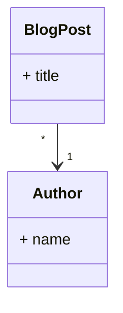

# Zurück in die Zukunft mit statischen Webseiten

Ein Blick auf das Astro Framework

<br />

Timo Zander (<a href="http://timozander.de">timozander.de</a>)  
enterJS 2023

<!--

- Willkommen in Darmstadt
- Timo Zander, Astro Framework
- Astro Hype
- heute: Warum Astro
- Presentation + Live Coding. Fragen am Ende

- Folien + Code auf Webseite, timozander.de
-->

---
layout: section
---

# Was?

<span class="text-xl mt-5">
Web-Framework mit Fokus auf Performance und statischen Inhalten
</span>

<div class="w-full flex flex-row gap-x-10 mt-15">
  <div class="flex flex-1 flex-col text-center items-center">
    <ph-file-code class="text-5xl" />
    Inhalte<br/>
    (HTML, Markdown, APIs, ...)<br/><br/>
    <br class="my-2"/>
    + UI-Frameworks
  </div>


   <div class="flex flex-1 flex-col items-center">
    <simple-icons-astro class="text-5xl" />
    Compiler
  </div>

  <div class="flex flex-1 flex-col  text-center items-center">
      <ph-files-fill class="text-5xl" />
      Statisches HTML, CSS, JS
    </div>

  <Arrow x1="300" y1="350" x2="420" y2="350" />
  <Arrow x1="550" y1="350" x2="670" y2="350" />


</div>

<!-- 
- Doch was ist Astro
- Web-Framework mit Fokus auf Inhalte: Blogs, Portfolios, E-Commerce
- Inhalte: aus verschiedenen Quellen
- Build durch Compiler (Integrationen und Plugins! Tailwind, React, ...)
- Statische Ausgabe: "Reine" HTML Dateien
- Deployment: Webserver, Edge, ...
- einreihen in Konkurrenz (ÜBERLEITUNG)

-->
---
layout: section
---

# Static Site Generators (SSG)

<div class="distribute relative">
  <logos-nextjs  />
  <logos-nuxt  />
  <logos-svelte-kit  />
  <logos-docusaurus  />
  <logos-remix  />

</div>

<div class="distribute relative">
  <logos-eleventy  />
  <logos-gatsby />
  <logos-hexo />
  <logos-gridsome />
  <logos-astro />

</div>

<style>
.slidev-page {
  background: #303c5f  !important;
}

svg {
  font-size: 120px;
}

.distribute {
  display: flex;
  padding: 20px 0;
  justify-content: space-between;
  align-items: center;
}

</style>

<!-- 
- Konkurrenz: SSGs
- Auswahl an Frameworks: welches nimmt man?

<br />

- jeder hat Lieblings Framework
- React vs Vue Kampf, "Svelte ist Revolution" 
- Wahl des Tools nach Framework ->  hilft nicht
- Next und Nuxt als Platzhirsche -> natürliche Wahl
- spezialisierte Tools: Docusaurus als Beispiel

<br/>

- viele von euch fragen sich: WARUM
- warum noch ein Framework
- Kritisch beäugt bei Neuem -> GUT SO!

<br />

- Zeigen was Astro besonders macht (4 Punkte)


-->


---
layout: section
---

# Warum Astro?

<div class="absolute top-50% -translate-y-50% left-35% text-2xl">

1. <twemoji-spiral-notepad /> Fokus auf Inhalts-lastigen Webseiten
2. <twemoji-rocket/> Hohe Performance durch null Client-JavaScript
3. <twemoji-desert-island /> Interaktivität dank Islands-Architektur
4. <twemoji-puzzle-piece /> Bring your own Framework

</div>

<style>
li {
  @apply my-5;
}

ol {
  @apply !list-none
}

svg {
  @apply mr-4;
}
</style>

<!-- 
- klarer Fokus
- Vergleich mit Next.js = kann alles
- Astro sagt klar: Inhalte-lastige Webseiten (und hat entsprechend Features)
- Wer JIRA nachbauen will, ist hier falsch

<br />

- PERFORMANCE: per default 0 client-JS
- doch ganz ohne JS ist nicht gut (Beispiele)
- Deshalb: Island-Architektur
- sorgt für Performance: schnelle Time-to-interactive!

<br />

- Framework-agnostisch
- EINFACH zu installiert
-->

---
layout: center
---

# Islands Architektur

<div class="flex w-full px-20 mt-2"> 
  

  <div class="flex-1 px-10 py-3 text-2xl items-center">
    
  Interaktive Elemente werden **nachgeladen**

  <br class="mb-9"  />

  Statische Elemente sind **sofort verfügbar**
  
  
  </div>

</div>

<!-- 
- Webseite in "Inseln" aufgeteilt
- statisch: wird in HTML-Datei statisch ausgeliefert
- dynamisch: erfordert Client-JS. Entweder rendern oder ladern

<br/>

- per Default alles statisch
- hilft für Performance: Keine Gedanken an Performance
- Client-JS immer ein bewusstes Opt-in
-->

---
layout: center
---

# MPA-Architektur


<table class="mt-12">
  <thead>
    <tr>
      <th></th>
      <th>Single-Page Application (SPA)</th>
      <th>Multi-Page Application (MPA)</th>
    </tr>
  </thead>

  <tr>
    <th>Rendering</th>  
    <td>Client</td>
    <td>Server</td>
  </tr>
  <tr>
    <th>Navigation</th>  
    <td>Client</td>
    <td>Server</td>
  </tr>
  <tr>
    <th>State-Management</th>  
    <td>Client</td>
    <td>Server</td>
  </tr>
  <tr>
    <th>Client-JavaScript</th>  
    <td>viel</td>
    <td>wenig bis keins</td>
  </tr>
</table>


<style>
th, td {
  @apply p-4 text-xl;
}
th {
  @apply font-bold;
}
td {
  @apply text-center;
}
</style>

<!--
- Astro hat MPA-Architektur
- im Gegensatz zu React und co

<br />

- SPA: nur eine index.html Datei, leer
- Client-JS rendert alles
- JS übernimmt Navigation, State-Management ...

<br />

- MPA: "traditionell" wie PHP etc.
- Server rendert HTML (mit Inhalten)
- Navigation = neue Request an Server, neue HTML Datei
- SESSIONS auf Server für State

<br />

- Spektrum: von SPA bis MPA
- z.B. serverseitig gerenderte SPAs, erhöht Initial-Performance
- kein gut oder schlecht
- für Astros Zwecke: MPA besser

-->

---
---

# Rendering Modi von Astro

<div class="w-full flex gap-x-10">

  <div class="flex-1">

  ### Static Site Generation (SSG)

  <div class="flex pt-8">
    <div class="flex flex-1 flex-col items-center">
      <ph-file-code class="text-5xl" />
      Astro-Quellcode
    </div>
    <div class="flex flex-1 flex-col items-center">
      <simple-icons-astro class="text-5xl" />
      Compiler
    </div>
    <Arrow x1="250" y1="230" x2="300" y2="230" />
  </div>
  <div class="flex pt-22">
    <div class="flex flex-1 flex-col items-center">
      <ph-computer-tower class="text-5xl" />
      Webserver
    </div>
    <Arrow x1="370" y1="300" x2="370" y2="350" />
    <div class="flex flex-1 flex-col items-center">
      <ph-files-fill class="text-5xl" />
      HTML, CSS, JS
    </div>
    <Arrow x1="300" y1="400" x2="250" y2="400" />
  </div>
  
  </div>


  <div class="flex-1">

  ### Server-side Rendering (SSR)

  <v-click>
  <div class="flex pt-8">
    <div class="flex flex-1 flex-col items-center">
      <ph-globe class="text-5xl" />
      URL Aufruf
    </div>
    <div class="flex flex-1 flex-col items-center">
      <simple-icons-astro class="text-5xl" />
      Astro-Runtime
    </div>
    <Arrow x1="690" y1="220" x2="740" y2="220" />
    <Arrow x2="690" y1="240" x1="740" y2="240" />
  </div>
  <div class="flex pt-22">
    <div class="flex flex-1 flex-col items-center">
    </div>
    <Arrow x1="830" y1="300" x2="830" y2="350" />
    <Arrow x1="810" y2="300" x2="810" y1="350" />
    <div class="flex flex-1 flex-col items-center">
       <ph-file-code class="text-5xl" />
      Astro-Quellcode
    </div>
  </div>
  </v-click>

  </div>

</div>

<!-- 

1. Statisches Rendern (wie erwähnt)
   -  Build wird ausgeführt
   -  Compiler gibt fertige HTML, CSS, JS Datei aus
   -  keine Spur mehr von Astro
   -  kostengünstig irgendwo statisch hosten (Nginx ...)
   -  in Stein gemeißelt: Nur Build ändert Inhalte

- klingt wie Rückschritt, aber:
- automatisieren mit Build-Pipeline
- Beispiel von meinem Blog
- wenige Minuten zwischen Commit + Live

klick
<br />

2. Serverseitiges Rendern
   - Request an Server (z.B. "About me")
   - Astro-Runtime rendert die Seite, gibt on demand HTML zurück 
   - Vorteil: Datenbanken, APIs, Echtzeit
   - Astro Fokus auf statischen Inhalten
   - deshalb heute: Schwerpunkt auf SSG
   - Syntax zu 90% gleich

-->

---
layout: section
---

# Astro in der Praxis
Ein neues Projekt mit Astro erstellen

<!-- wie sieht ein Astro Projekt aus -->

---
---

## Ein Astro-Projekt zum Leben erwecken

<br class="block mb-20" />

```bash
$ pnpm create astro@latest
```

[oder online auf astro.new](https://astro.new/)

<br class="mb-2" />

Starten des Entwicklungs-Servers mit `pnpm dev`

<style>
  p {
    @apply text-2xl pt-5 text-center;
  }
</style>


<!-- 
- schnell erstellt
- CLI oder online
- vielzahl von Templates
- vom leeren Projekt bis "Kitchen sink"
- heute: leeres Projekt
- reminder: Sourcecode online
-->

---

# Ein neues Astro Projekt
```bash {all|2|6-9}
├── README.md
├── astro.config.mjs
├── node_modules/
├── package.json
├── pnpm-lock.yaml
├── public/
│   └── ...
├── src/
│   └── ...
└── tsconfig.json
```

<!--
- überwiegend Standard

klick

- Astro-Config: Add-ons, Verhalten des Frameworks, ...
- z.B. vue als "integration" hinzufügen

klick 

- interessant sind public und src
- public: Dateien und Assets, welche *nicht* vom Build berührt werden (z.B. robots.txt)
- src: Quellcode, folgt jetzt
-->

---
---

# Das `src` Verzeichnis
```bash {2,4,6}
├ src
  ├── components
  │   └── Card.astro
  ├── layouts
  │   └── Layout.astro
  ├── pages
  │   └── index.astro
  └── env.d.ts
```

Astro-Webseiten bestehen aus **Komponenten**, **Layouts** und **Seiten**.

<style>
  p {
    @apply text-2xl;
  }
</style>

<!-- 
- Bausteine: Komponenten, Layouts, Seiten
- Seite: wie man denkt, eigene URL, eigene HTML-Datei
- Layouts: Skelett
  - HTML Basics wie DOCTYPE oder `<head>`
  - wird mit Inhalten und Komponenten gefüllt
- Komponente: wie in UI-Frameworks. Button, Dropdown, ...
- Beispiel persönlicher Blog

-->

---
layout: center
---

# Anatomie einer Astro Seite

<div>
<div class="relative mt-4">
    
    <div class="highlight"></div>
    <div class="highlight layout"></div>
    <div class="highlight component"></div>
</div>

<div class="text">
  <span class="highlight" /> Seite <br/>
  <span class="highlight layout" /> Layout <br/>
  <span class="highlight component" /> Komponente
</div>
</div>

<style>
  img {
    border: 2px solid var(--slidev-theme-accents-vulcan);
    width: 70%;
  }

  div.highlight {
    border: 3px solid var(--slidev-theme-accents-red);
    position: absolute;
    width: 606px;
    height: 100%;
    left: 0;
    top: 0;
  }
  div.highlight.layout {
    border-color: var(--slidev-theme-accents-teal);
    width: 600px;
    margin-left: 3px;
    margin-top: 3px;
    height: calc(100% - 6px)
  }
  div.highlight.component {
    border-color: var(--slidev-theme-accents-yellow);
    width: 120px;
    height: 45px;

    top: 240px;
    left: 340px;
  }

  span.highlight {
    @apply inline-block w-3 h-3;
    background-color: var(--slidev-theme-accents-red);
  }
  span.highlight.layout {
    background-color: var(--slidev-theme-accents-teal);
  }
  span.highlight.component {
    background-color: var(--slidev-theme-accents-yellow);
  }

  .text {
    @apply absolute text-2xl;

    left: 700px;
    top: 300px;
  }
</style>

<!--
- Beispiel: persönliche Seite (mit Astro)
- Startseite = Page

<br/>

- Layout: gesamte Seite, von `<head>` bis `</body>`
- Social Media Icons: Komponente
- wird wiederverwendet im Footer

- Layouts und Astro-Komponenten technisch nahezu gleich!

weiter mit Komponenten
-->

---

# Astro Komponenten

src/components/Date.astro
```astro
---
const date = new Date();
---

<p>Heute ist {date.toLocaleDateString()}</p>
```

<!--
- simpel aufgebaut
- optionaler JS-Header mit Fences
  - da optional: jede HTML-Datei ist gültige Astro-Komponente
- beliebiger HTML-Code mit JSX-Syntax
- JS-Code in geschweiften Klammern

<br />

- Besonderheit von SSG: Code wird nur beim Build ausgeführt
- muss man sich gewöhnen, da JS-Code nicht immer "frisch"
- Datum bleibt also fix auf Build-Zeit

weitere, realitätsnahe Komponente...
-->

---
---

<span class="absolute top-7">src/components/LinkButton.astro</span>

```astro {all|2-8}
---
export type ButtonType = "primary" | "default";
interface Props {
  href: string;
  type?: ButtonType;
  disabled?: boolean;
  target?: HTMLAttributeAnchorTarget;
}
const { href, type = "default", disabled = false, target = undefined } = Astro.props;
---
<a
  type="button"  
  href={disabled ? "#" : href}
  tabindex={disabled ? "-1" : "0"}
  class={`button-${type}`}
  target={target}
>
  <slot />
</a>

<style>
/* ... */
</style>
```

<style>
  .slidev-code {
  --slidev-code-font-size: 14px;
  --slidev-code-line-height: 20px;
  --slidev-code-padding: 12px;
}
</style>

<!-- 
- (wall of code)
- LinkButton von meinem Blog
- zuerst JS

klick

- TypeScript Typen: definieren und exportieren klappt
- `ButtonType` woanders wiederverwenden
- `Props` sind die Props der Komponente (Konvention)
- sorgt für Auto-Complete und Typisierung

-->

---
---

# Props in Astro-Komponenten

```astro
 <LinkButton
  href={email.href}
  type="primary"
  className={"cta-button"}
  target="_blank"
>
  Get in touch
</LinkButton>
```

<span class="text-3xl">Props sind **typisiert**</span>

<!-- 
- Syntax ist wie bei React, Vue usw.
- Auto-Complete dank Props interface
-->

---
---

```astro
---
// ...
const { 
  href, type = "default", 
  disabled = false, target = undefined 
} = Astro.props;
---
<a
  type="button"  
  href={disabled ? "#" : href}
  tabindex={disabled ? "-1" : "0"}
  class={`button-${type}`}
  target={target}
>
  <slot />
</a>
```

<!-- 
- Props können im Astro.props Objekt abgerufen werden
- Nutzung im Markup
- bekannte JSX-Syntax
- Slots
-->

---
---

# Frontend-Frameworks nutzen

src/pages/index.astro
```astro
---
import MyVueComponent from './components/MyComponent.vue';
---

<div>
  <MyVueComponent />
</div>
```

<span class="text-2xl">Komponenten werden **automatisch** statisch gerendert</span>

<!-- 
- Clue: statt Astro-Komponenten eigenes FE-Framework nutzen
- einfach offizielle Plugins für Vue, React, Svelte, Preact, Solid, Lit, Alpine,...
- `pnpm astro add vue` -> fertig
- Astros Kern bleibt: alles statisch gerendert per default
 -->

---
layout: section
---

# Pages und Navigation

<!-- 
- Komponente klar
- jetzt: Pages und Navigation

Astro nutzt MPA -> mehrere Pages
-->

---
---

# Die `index.astro` Page

```astro
---
import Layout from "../layouts/Layout.astro";
import Date from "../components/Date.astro";
---

<Layout title="Welcome to Astro.">
  <main>
    <h1>
      Welcome to <span class="text-gradient">Astro</span>
    </h1>

    <Date />
  </main>
</Layout>
```

<!-- 
- 1 URL = 1 HTML Datei = 1 Astro Page
- Beispiel-Page

- Pages sind "Kleber" zwischen Layouts und Komponenten
- Komponente nicht genutzt -> nicht im Output
<br/>

- JS Header mit 3 Fences
- Erinnerung: nur im Build ausgeführt
-->

---

# File-based routing

<span class="text-2xl">

Der **Dateiname** bestimmt die **URL** der Seite

</span>

```cs {all|6}
├── pages/
    ├── index.astro      --> /
    ├── about.md         --> /about
    ├── blog/
    │   ├── index.astro  --> /blog
    │   └── [slug].astro --> /blog/:slug
    └── rss.xml.ts       --> /rss.xml
  
```

<!--
- File-based Routing
- Verzeichnisstruktur bestimmt URLs (Slide erklären)
- Dateitypen: .astro, .md, .html, .ts

klick
<br/>

- unter Blog: eckige Klammern im Dateiname
- dynamische Route
- nicht nur statische Pfade wie Home oder About
- Beispiel Blog: nicht für jeden Beitrag Seite copy-pasten

LIVE CODING 01-start
-->

---
layout: section
---

# Islands-Architektur angewandt

Client-seitiges JavaScript mit Astro

<!-- 
- wie funktioniert Islands nun?
- standard ist kein Client-JS
- wie schaffe ich nun JS auf Client?
-->

---

# `script` in Komponenten

```astro
---
console.log("Hello aus dem Build!")
---

<button>Test</button>

<script>
  console.log("Hello aus dem Browser!")
</script>
```

<!--
- JS an 2 Stellen:
- Header im Build
- `<script>` Tag im Browser

LIVE CODING 02-start
-->

---
---

# Verarbeitung von client-side JavaScript

1. Importe werden ge-bundled
2. Das JavaSkript wird zum HTML-Head hinzugefügt
3. Skripte werden **nicht** gedoppelt
4. TypeScript wird unterstützt


<style>
li {
  @apply text-3xl mb-6;
}
</style>

<!-- 
- ihr seht: Astro scheint zu optimieren
- Script nur einmal da -> was tut Astro?

<br/>

- Skript-Tags in Build Pipeline (Code optimierung und Import bundling)

1. Importe werden gebundled (imports nicht in extra Dateien)
2. Skripte werden in den head verschoben, keine Duplikate
3. TypeScript ist eingebaut: Transpilieren + Checken


-->

---

# Skripte "pur" verwenden

```astro {7}
---
console.log("Hello aus dem Build!")
---

<button>Test</button>

<script is:inline>
  console.log("Hello aus dem Browser!")
</script>
```

<span class="text-xl">

`is:inline` Skript-Tags werden **nicht** vom Build verarbeitet

</span>

<!--
- Skripte 1:1 im Build behalten
- neben `is:inline` noch andere Direktiven

Was geht also nicht?
- keine Importe (relativ oder npm Packages)
- kein Verschieben in den head
- kein Bundling in externe Datei -> kein defer (async laden)
MEHR DETAILS
-->

---

# Client-Rendering mit Direktiven steuern

```astro
---
// Wichtig: keine .astro Komponente
import LongTask from "../components/LongTask.vue";
---

<LongTask client:load />

<LongTask client:idle />

<p class="spacer">Scroll down</p>

<LongTask client:visible />
```

<!--
- bei UI-Frameworks (React, Vue, ...) -> clientseitig rendern aktivieren
- Steuern WANN gerendert/ausgeführt wird mit client-Direktiven
- nicht für Astro Komponenten -> immer SSR

1. load -> direkt am Anfang. "Überlebenswichtige" Sachen
2. idle -> wenn Client idled (schon interaktiv)
3. visible -> Mittelweg, wenn Komponente sichtbar wird
   - Komponente im Footer: nicht jeder scrollt
   - kann Zeit sparen

seit Astro 2.6: eigene Direktiven
-->

---
layout: section
---

# Dynamische Inhalte und statische Seiten

<!-- 
- Basics fertig
- jetzt los ziehen und Astro Seite bauen
- Spaß weil: gute Doks + hilfreiche Fehler (eben gesehen)

<br />

- Fader Beigeschmack: Dynamische Inhalte?
- niemals so "live" wie nicht-SSG Lösung, klar
- aber neuer Blog Post sollte kein Riesen Aufwand sein

jetzt: Wie Astro dynamische Inhalte unterstützt
 -->

---
---


# Content Collections

```py
─ src/pages/
  ├── newsletter/
  │   ├── new-subcriber.md
  │   ├── featured-links-may-2023.md
  │   └── ...
  ├── blog/
  │   ├── welcome-post.md
  │   ├── what-i-learned-2022-post.md
  │   └── ...
  └── authors/
      ├── zander.json
      └── ...
```

<!-- 
- oft kein CMS oder DB nötig
- einfacher Blog und Portfolio: Inhalte strukturiert als Dateien
- Performance egal: Build ggf. länger, aber who cares (wenige Sekunden)

<br />

- daher: Content Collections
- strukturierte Inhalte in Dateien

<br/>

- Blog-Posts und Newsletter Einträge
- Markdown (Inhalte) oder JSON (reine Daten)
- Markdown hat Frontmatter-Header mit Attributen (z.B. title)
-->

---
---

# Einträge typisieren

```ts {all|4-11|13-15}
// src/content/config.ts
import { z, defineCollection } from 'astro:content';

const blogCollection = defineCollection({
  type: 'content', // oder 'data'
  schema: z.object({
    title: z.string(),
    tags: z.array(z.string()),
    image: z.string().optional(),
  }),
});

export const collections = {
  blog: blogCollection,
};
```

<style>
.slidev-code {
  --slidev-code-font-size: 22px;
  --slidev-code-line-height: 26px;
  --slidev-code-padding: 8px;
}
</style>


<!-- 
- Zod ist integriert
- umfangreiche Typ-API für exotische Edge Cases
- sorgt für typisierte Auto-Complete und Build-Check

klick

- Collection für Blog-Posts
- Zod validiert Frontmatter-Header

klick

- export benötigt blog Key
- key = Ordnername
 -->

---
---

# Inhalte aus Collections nutzen

```ts 
import { getCollection } from 'astro:content';

const blogPosts = await getCollection('blog');
```

```jsx
<section>
  <h2>Blog-Einträge</h2>
  {
    blogPosts.map((post) => (
      <a href={"blog/" + post.slug}>{post.data.title}</a>
    ))
  }
</section>
```

<!-- 
- Abruf mit `getCollection()`
- slug: URL-Friendly Version des Dateinamens (unique ID)
- data Attribut in Schleife: Frontmatter-Attribute (typisiert!!)
- bei Typ-Verletzung: Build schlägt fehl

LIVE CODING 04-start
 -->

---
---

# Daten referenzieren

<div class="w-2/3">

```ts
const blog = defineCollection({
  type: 'content',
  schema: z.object({
    title: z.string(),
    author: reference('authors'),
    relatedPosts: z.array(reference('blog')),
  })
});

const authors = defineCollection({
  type: 'data',
  schema: z.object({
    name: z.string(),
  })
});
```
</div>

<div class="absolute top-40 right-30">


</div>

<style>
  .slidev-code {
  --slidev-code-font-size: 20px;
  --slidev-code-line-height: 24px;
  --slidev-code-padding: 12px;
}
</style>

<!-- 
- JSON in Content Collections neu seit Astro 2.5
- vereinfachte, Datei-basierte Datenbank
- Referenzen möglich!

<br />

- sorgt für Datenintegrität
- wie in SQL, Blog-Post muss immer Autor haben (kein "von undefined undefined")

optional: LIVE CODING 05-start
 -->

---
layout: center
---


<div class="p-5 text-3xl mb-10">

> Jedem Anfang wohnt ein Zauber inne.  
</div>

- Loslegen unter [astro.new](https://astro.new/)
- Nutzt Astro für euren Blog, ein Portfolio, ...
- ...und **nicht** für interaktive Dashboards und co
- Lernt das Framework zu lieben (oder zu hassen!)

<br class="mb-6" />

Alle Unterlagen findet Ihr auf [timozander.de](https://timozander.de)

<style>
blockquote {
  @apply !p-6;
}

li {
  @apply text-2xl mb-3;
}
</style>

<!-- 
Heinrich Heine

- Empfehlung: Wenn gefallen, dann probiert Astro aus
- für Astro-taugliches Projekt (und nicht für Webanwendung)
- falls gefällt: großartig
- falls nicht: genauso gut - Findet das Tool, was für EUCH am besten passt
- noch viel mehr zu entdecken: Asset Optimierung, Endpoints, ...
-->
